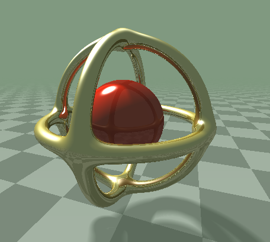

# test_raymarching


https://roodni.github.io/test_raymarching/index.html

## What's this
A test shader program of sphere tracing
- Phong shading
- Specular reflection
- Soft shadow
- Ambient occlusion

## How to Run
1. Put it on server
2. Open `index.html` in your browser

Example (using python3):
```
git clone https://github.com/roodni/test_raymarching.git
cd test_raymarching
python3 -m http.server 8000
open http://localhost:8000/
```

It also runs on [GLSL Sandbox](http://glslsandbox.com/e#58405.0).